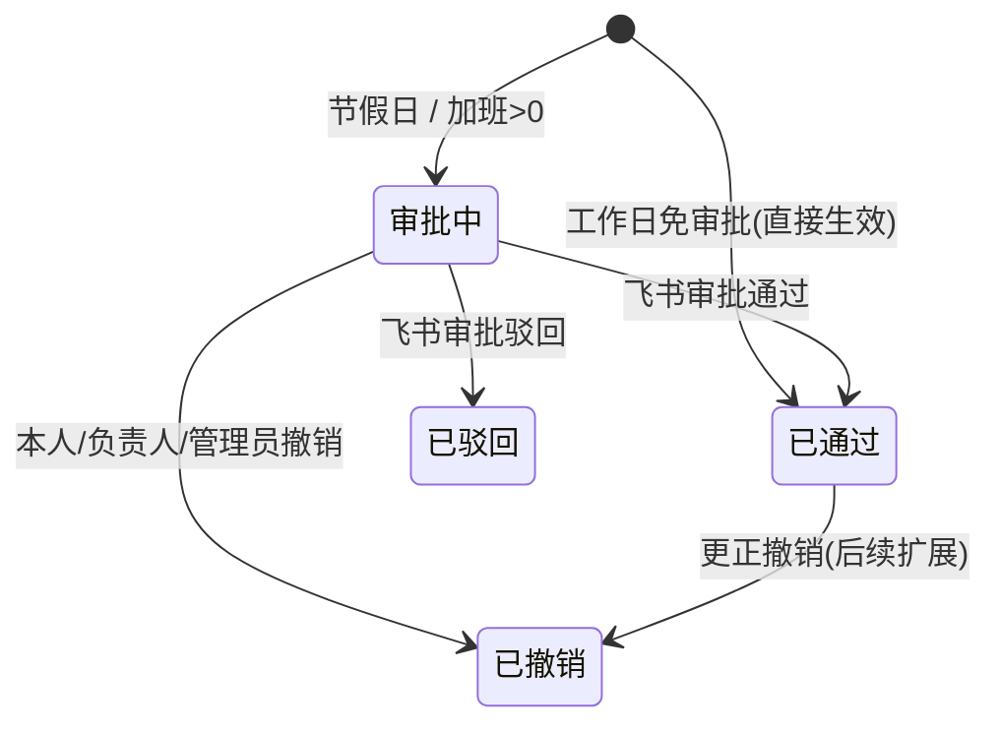

<!--
 * @Author: lzx 1245634367@qq.com
 * @Date: 2026-08-03 22:21:09
 * @LastEditors: lzx 1245634367@qq.com
 * @LastEditTime: 2026-08-03 22:21:10
 * @FilePath: \feishu-work\docs\01-需求确认与业务规则.md
 * @Description: Fuck Bug
 * 微信：lizx2066
-->
# 01 · 需求确认与业务规则

> 基于原始 9 条需求，经确认后的最终业务规则定义。**所有模块与数据表设计均以此为准。**

## 一、原始需求清单

| # | 需求 | 说明 |
|---|---|---|
| 1 | 项目列表增删改查 | 指定用户（负责人/管理员）才能操作 |
| 2 | 报工列表增删改查 | 报工关联项目；指定用户可删改 |
| 3 | 用户报工到指定项目 | 普通用户可对项目报工 |
| 4 | 工作日免审批额度 8 小时 | 不允许超过 8 小时 |
| 5 | 输入加班时长需走审批 | 触发条件需确认 |
| 6 | 报工必须在"节假日内" | ⚠️ 与第 4 条冲突，已确认 |
| 7 | 直接用飞书用户列表 | 不新增用户表 |
| 8 | 审批提醒走飞书 | 飞书消息通知 |
| 9 | 技术栈 Node + MySQL + Vue | 已定 |

## 二、可行性结论

✅ **可实现**，飞书开放平台能力完全覆盖：

| 能力 | 飞书方案 | 对应权限 |
|---|---|---|
| 用户列表（不建用户表） | 通讯录 API 拉取 + 本地缓存 | `contact:user.base:readonly` |
| 用户身份识别 | 网站应用网页授权（OAuth）登录 | 网页应用能力 |
| 审批 | 飞书审批中心：创建实例 + 事件回调 | `approval:approval` |
| 审批/消息提醒 | 应用消息 API（文本/卡片） | `im:message` |
| 节假日判断 | 自维护日历配置表（可自动同步） | 无需飞书权限 |

## 三、需求确认结果（关键）

原第 4 条与第 6 条直接冲突，经确认最终规则：

| 原始描述 | 确认后规则 |
|---|---|
| 第6条：必须是节假日内、非节假日不允许提交 | **工作日与节假日均可报工；节假日报工一律走审批** |
| 第5条：输入了加班时长 | 报工单内**单独填写「加班时长」字段**，`>0` 即整单走审批 |
| 登录方式 | 飞书**网站应用（网页授权 OAuth）**直接对接，自动识别登录人 |

## 四、最终业务规则

### 4.1 时间与审批规则

| 场景 | 普通时长 | 加班时长 | 是否审批 | 说明 |
|---|---|---|---|---|
| 工作日 | ≤ 8 小时 | = 0 | ❌ 免审批 | 提交即生效，状态=已通过 |
| 工作日 | ≤ 8 小时 | > 0 | ✅ 审批 | 整单走飞书审批 |
| 工作日 | > 8 小时 | 任意 | ⛔ 拦截不允许 | 超 8 小时请填加班时长走审批（需求4） |
| 节假日/周末 | 任意（建议=0） | 任意 | ✅ 一律审批 | 节假日上班视为加班 |

> 规则映射：
> - **需求4** → 工作日免审批额度 8 小时；普通时长上限 8 小时，超出不允许提交；
> - **需求5** → 加班时长字段 `>0` → 整单走审批；
> - **需求6（已确认）** → 节假日可报工，但一律走审批。

### 4.2 权限规则

| 角色 | 来源 | 权限 |
|---|---|---|
| 全局管理员 | `admin` 表（open_id 列表） | 所有项目/报工的增删改、日历与配置维护、查看全部数据 |
| 项目负责人（"指定用户"） | `project_member.role=1` | 修改/删除自己负责的项目、查看项目报工 |
| 普通用户 | 飞书通讯录 | 查看项目、向进行中项目报工 |

- **报工删改权限**：仅报工**本人**、项目**负责人**、**管理员**可编辑/撤销。
- 审批已通过的报工默认**不可再修改/删除**（如需更正走「撤销」流程，见待确认事项）。
- 项目删除：有关联报工时提示（软删除，历史数据保留）。

### 4.3 其他约定

- **用户数据**：一律以飞书 `open_id` 关联，姓名等做快照冗余，**不建用户表**。
- **删除**：项目/报工均采用软删除（`deleted` 字段）。
- **报工状态机**：

### 4.4 边界与异常

- 报工日期只能选择 ≤ 今天（不允许补未来日期）；是否允许补历史日期 → 待确认。
- 同一用户同一项目同一天是否允许多条报工 → 默认**不允许重复**（唯一约束，见数据表设计）。
- 节假日自动判定：默认周一到周五为工作日、周六日为节假日；`calendar_rule` 表维护例外（法定节假日、调休上班日）。
- 审批人默认取**项目负责人**，可扩展为多级审批/指定审批人。
