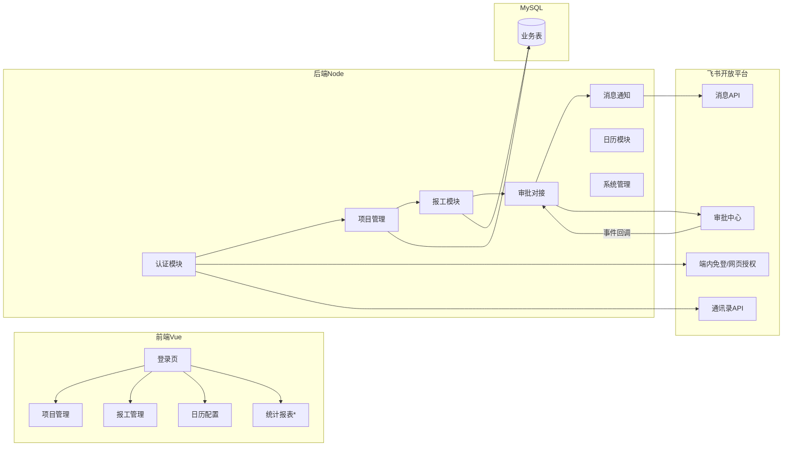
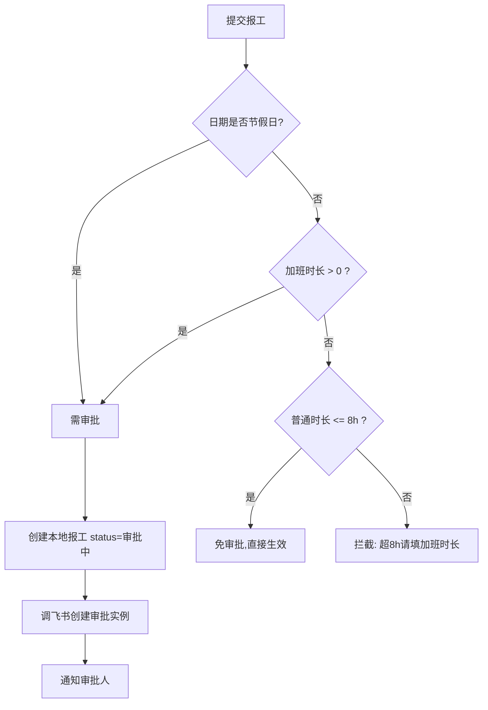
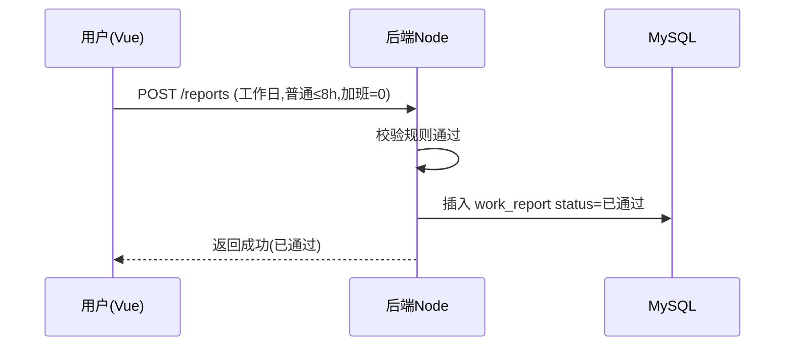
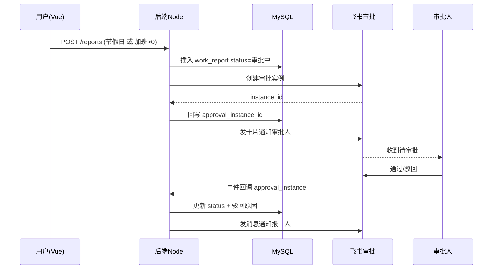

<!--
 * @Author: lzx 1245634367@qq.com
 * @Date: 2026-08-03 22:21:11
 * @LastEditors: lzx 1245634367@qq.com
 * @LastEditTime: 2026-08-03 22:21:12
 * @FilePath: \feishu-work\docs\02-模块拆解.md
 * @Description: Fuck Bug
 * 微信：lizx2066
-->
# 02 · 模块拆解

## 一、模块总览

## 二、模块 1：用户认证与通讯录（对接飞书）

**目标**：用户不建表，登录后即识别为飞书用户；选择用户时从飞书通讯录拉取。

- 功能点
  1. **端内免登（主）**：前端调 `tt.requestAccess`/`requestAuthCode` 拿预授权码 → 后端换 `user_access_token` → 拉 `user_info` 得 open_id/name → 签发本系统 JWT（详见 04 文档三节）
  2. 网页授权 OAuth（备选）：浏览器直接访问时走授权回调
  3. 后端签发 JWT（携带 open_id）作为本系统会话凭证
  4. 通讯录用户列表：按需从飞书拉取并缓存到 `feishu_user_cache`（用于下拉选择报工人/负责人）
  5. 当前用户信息接口（前端显示姓名、头像、是否管理员）
- 页面：登录页（免登中转）、用户选择组件（下拉/搜索）
- 接口：
  - `POST /auth/feishu/login` → 端内免登：收 code，换 token 拉用户，签发 JWT（主）
  - `GET /auth/feishu/authorize` / `GET /auth/feishu/callback` → 网页授权（浏览器访问备选）
  - `GET /auth/me` → 当前用户信息
  - `GET /users?keyword=` → 通讯录用户列表（缓存+飞书）
  - `GET /users/sync` → 手动/定时同步通讯录（管理员）

## 三、模块 2：项目管理

**目标**：项目增删改查 + 指定负责人（"指定用户"）。

- 功能点
  1. 项目列表：分页、关键字搜索、状态过滤（进行中/暂停/归档）
  2. 新增项目：名称、编号、描述、起止日期、负责人（从飞书用户多选）
  3. 编辑项目：仅负责人/管理员
  4. 删除项目：软删除；有关联报工时前端提示、后端拒绝或仅归档
  5. 项目详情：基本信息 + 负责人 + 该项目报工列表
- 页面：项目列表页、项目表单（新建/编辑）、项目详情页
- 接口：
  - `GET /projects`、`GET /projects/:id`
  - `POST /projects`、`PUT /projects/:id`、`DELETE /projects/:id`
  - `PUT /projects/:id/members`（负责人调整）
- 权限校验：增删改仅管理员/项目负责人。

## 四、模块 3：报工管理

**目标**：报工关联项目，支持增删改查与权限控制；核心校验逻辑在此。

- 功能点
  1. 报工列表：按人/项目/日期/状态筛选，展示普通时长、加班时长、总时长、状态
  2. 报工提交（关键）：选项目 → 选报工日期 → 填普通时长 → 填加班时长（可选）→ 备注
  3. 报工校验规则（后端强校验）：
     - 项目必选且为进行中
     - 日期必填、不可为未来日期
     - 普通时长、加班时长 ≥ 0，精度 0.5h
     - 同人同项目同日不可重复（唯一约束）
     - **工作日**：普通时长 ≤ 8h；普通 > 8h 拦截；加班 > 0 → 需审批
     - **节假日**：一律需审批
  4. 报工编辑/撤销：仅本人/负责人/管理员；审批中可撤回（撤销飞书审批实例）；已通过不可改
  5. 报工状态展示（审批中/已通过/已驳回/已撤销 + 驳回原因）
- 页面：报工列表页、报工表单（提交）、报工详情
- 接口：
  - `GET /reports`、`GET /reports/:id`
  - `POST /reports`（含审批判定与触发）
  - `PUT /reports/:id`（编辑，审批前）
  - `DELETE /reports/:id`（撤销）
- **审批判定逻辑**（提交时）：

## 五、模块 4：审批对接（飞书审批中心）

**目标**：需审批的报工走飞书审批，结果回写本地。

- 功能点
  1. 创建审批实例：审批定义（`approval_code`，如"报工审批"）在飞书审批后台创建；实例表单含 项目/日期/普通时长/加班时长/备注/申请人
  2. 审批人：默认项目负责人（`node_approver_open_id_list`）
  3. 事件订阅：飞书 `approval_instance` 事件回调 → 解析 → 更新本地 `work_report` 与 `work_report_approval`
  4. 主动兜底：定时任务查询审批实例状态（`GET /approval/v4/instances/:id`）防丢事件
  5. 撤回审批：报工撤销时调用飞书撤销审批实例
- 接口/回调：
  - 内部：`POST /internal/feishu/approval-callback`（事件订阅地址）
  - 内部：`GET /internal/approvals/status`（兜底轮询）
- 状态映射：

| 飞书审批状态 | 本地 status |
|---|---|
| PENDING / 审批中 | 1 审批中 |
| APPROVED | 2 已通过 |
| REJECTED | 3 已驳回 |
| CANCELED / 已撤销 | 4 已撤销 |

## 六、模块 5：消息通知（飞书消息）

**目标**：审批相关提醒全部走飞书消息。

- 通知场景
  1. 报工提交需审批 → 卡片通知**审批人**（附「查看详情」「审批」入口，跳飞书审批或本系统）
  2. 审批通过/驳回 → 通知**报工人**（含通过/驳回原因）
  3. 超时未审批 → 定时任务提醒审批人
  4. 免审批报工生效 → 可选通知报工人
- 发送方式：`POST /open-apis/im/v1/messages?receive_id_type=open_id`，msg_type=`interactive`（卡片）或 `text`
- 记录：`message_log` 表记录发送结果，失败可重试
- 接口：内部 `POST /internal/messages/send`

## 七、模块 6：节假日/日历配置

**目标**：判断某日期是否节假日/工作日，支撑审批判定。

- 功能点
  1. 默认规则：周一~周五=工作日，周六/周日=节假日
  2. `calendar_rule` 例外配置：法定节假日（工作日→节假日）、调休上班日（周末→工作日）
  3. 自动同步（可选）：对接第三方节假日接口（如 timor.tech）或飞书日历，`source=auto`，人工可覆盖
  4. 日期判定接口：`GET /calendar/is-holiday?date=`（供前端回显"该日按节假日报工将走审批"）
- 页面：日历配置页（管理员）
- 接口：`GET /calendar/rules`、`POST /calendar/rules`、`DELETE /calendar/rules/:id`、`GET /calendar/is-holiday`

## 八、模块 7：系统管理/配置

- 管理员维护：`admin` 表（open_id 列表）
- 系统配置：`system_config`（工作日额度 8h、审批定义编码 `approval_code`、管理员列表等）
- 飞书应用配置：app_id / app_secret（建议放环境变量，不进库）
- 操作日志：`audit_log` 记录关键操作
- 页面：系统设置页（管理员）

## 九、模块 8：统计报表（后续扩展，建议纳入）

> 报工系统通常会需要，列为扩展模块。

- 按人/项目/月份的工时汇总、加班汇总
- 免审批 vs 审批通过占比、驳回率
- 页面：报表页（ECharts）
- 接口：`GET /statistics/hours?group=user|project|month`

## 十、关键流程时序

### 10.1 免审批报工

### 10.2 需审批报工

## 十一、模块与数据表映射

| 模块 | 数据表 |
|---|---|
| 认证/用户 | `feishu_user_cache` |
| 项目管理 | `project`、`project_member` |
| 报工 | `work_report`、`work_report_approval` |
| 日历 | `calendar_rule` |
| 系统管理 | `admin`、`system_config`、`audit_log` |
| 消息通知 | `message_log` |
