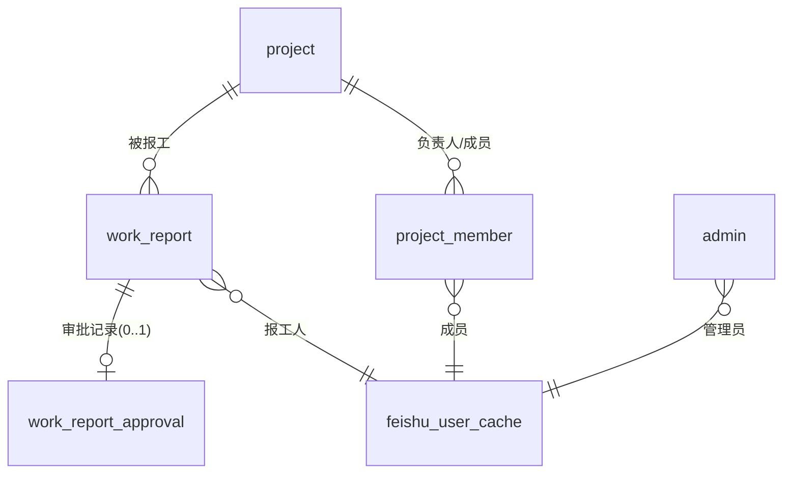

<!--
 * @Author: lzx 1245634367@qq.com
 * @Date: 2026-08-03 22:21:56
 * @LastEditors: lzx 1245634367@qq.com
 * @LastEditTime: 2026-08-03 22:21:57
 * @FilePath: \feishu-work\docs\03-数据表设计.md
 * @Description: Fuck Bug
 * 微信：lizx2066
-->
# 03 · 数据表设计（MySQL）

> 数据库：MySQL 8.x，引擎 InnoDB，字符集 `utf8mb4`。
> 设计约定：① 用户一律以飞书 `open_id` 关联，**不建用户表**，姓名做快照冗余；② 业务表软删除（`deleted`）；③ 时间统一 `DATETIME`。

## 一、ER 关系图



## 二、表清单总览

| 表名 | 说明 | 关键点 |
|---|---|---|
| `project` | 项目表 | 状态、起止日期、软删除 |
| `project_member` | 项目成员/负责人表 | 指定用户的载体（role=1 负责人） |
| `work_report` | 报工表 | 时长、节假日标记、审批状态、审批实例ID |
| `work_report_approval` | 报工审批同步表 | 飞书审批实例 ID 唯一、表单快照、回调原文 |
| `calendar_rule` | 日历/节假日配置表 | 例外配置（法定节假日/调休上班日） |
| `feishu_user_cache` | 飞书用户缓存表 | 通讯录缓存，下拉选择用 |
| `admin` | 全局管理员表 | open_id 列表 |
| `system_config` | 系统配置表 | 8h 额度、审批编码等 |
| `message_log` | 消息发送记录表 | 飞书消息发送结果 |
| `audit_log` | 操作日志表（可选） | 关键操作留痕 |

## 三、DDL

### 3.1 `project` 项目表

```sql
CREATE TABLE `project` (
  `id`                  BIGINT UNSIGNED NOT NULL AUTO_INCREMENT COMMENT '主键',
  `name`                VARCHAR(100)    NOT NULL COMMENT '项目名称',
  `code`                VARCHAR(50)     DEFAULT NULL COMMENT '项目编号',
  `description`         VARCHAR(500)    DEFAULT NULL COMMENT '项目描述',
  `status`              TINYINT         NOT NULL DEFAULT 1 COMMENT '状态:1=进行中,2=暂停,3=已归档',
  `start_date`          DATE            DEFAULT NULL COMMENT '开始日期',
  `end_date`            DATE            DEFAULT NULL COMMENT '结束日期',
  `created_by_open_id`  VARCHAR(64)     DEFAULT NULL COMMENT '创建人飞书open_id',
  `created_at`          DATETIME        NOT NULL DEFAULT CURRENT_TIMESTAMP COMMENT '创建时间',
  `updated_at`          DATETIME        NOT NULL DEFAULT CURRENT_TIMESTAMP ON UPDATE CURRENT_TIMESTAMP COMMENT '更新时间',
  `deleted`             TINYINT         NOT NULL DEFAULT 0 COMMENT '软删除:0=否,1=是',
  PRIMARY KEY (`id`),
  KEY `idx_status`     (`status`, `deleted`),
  KEY `idx_created_at` (`created_at`)
) ENGINE=InnoDB DEFAULT CHARSET=utf8mb4 COLLATE=utf8mb4_general_ci COMMENT='项目表';
```

### 3.2 `project_member` 项目成员/负责人表

```sql
CREATE TABLE `project_member` (
  `id`         BIGINT UNSIGNED NOT NULL AUTO_INCREMENT,
  `project_id` BIGINT UNSIGNED NOT NULL COMMENT '项目ID → project.id',
  `open_id`    VARCHAR(64)     NOT NULL COMMENT '飞书用户open_id',
  `user_name`  VARCHAR(100)    DEFAULT NULL COMMENT '姓名快照',
  `role`       TINYINT         NOT NULL DEFAULT 2 COMMENT '角色:1=负责人(指定用户,可管理),2=普通成员',
  `created_at` DATETIME        NOT NULL DEFAULT CURRENT_TIMESTAMP,
  PRIMARY KEY (`id`),
  UNIQUE KEY `uk_project_user` (`project_id`, `open_id`),
  KEY `idx_open_id` (`open_id`)
) ENGINE=InnoDB DEFAULT CHARSET=utf8mb4 COLLATE=utf8mb4_general_ci COMMENT='项目成员表';
```

### 3.3 `work_report` 报工表（核心）

```sql
CREATE TABLE `work_report` (
  `id`                   BIGINT UNSIGNED NOT NULL AUTO_INCREMENT,
  `report_no`            VARCHAR(32)     DEFAULT NULL COMMENT '报工单号(可选,如 WR20260803001)',
  `project_id`           BIGINT UNSIGNED NOT NULL COMMENT '项目ID → project.id',
  `report_date`          DATE            NOT NULL COMMENT '报工日期',
  `is_holiday`           TINYINT         NOT NULL DEFAULT 0 COMMENT '是否节假日(提交时按日历判定):0=工作日,1=节假日',
  `normal_hours`         DECIMAL(4,1)    NOT NULL DEFAULT 0 COMMENT '普通时长(小时,≤8)',
  `overtime_hours`       DECIMAL(4,1)    NOT NULL DEFAULT 0 COMMENT '加班时长(小时,>0需审批)',
  `total_hours`          DECIMAL(4,1)    NOT NULL DEFAULT 0 COMMENT '总时长=普通+加班',
  `remark`               VARCHAR(500)    DEFAULT NULL COMMENT '备注',
  `need_approval`        TINYINT         NOT NULL DEFAULT 0 COMMENT '是否需审批:0=免审批,1=需审批',
  `status`               TINYINT         NOT NULL DEFAULT 1 COMMENT '状态:1=审批中,2=已通过,3=已驳回,4=已撤销',
  `approval_instance_id` VARCHAR(128)    DEFAULT NULL COMMENT '飞书审批实例ID(需审批时有值)',
  `approver_open_id`     VARCHAR(64)     DEFAULT NULL COMMENT '当前审批人open_id(冗余)',
  `reject_reason`        VARCHAR(500)    DEFAULT NULL COMMENT '驳回原因',
  `approved_at`          DATETIME        DEFAULT NULL COMMENT '通过时间(统计用)',
  `user_open_id`         VARCHAR(64)     NOT NULL COMMENT '报工人open_id',
  `user_name`            VARCHAR(100)    DEFAULT NULL COMMENT '报工人姓名快照',
  `created_by`           VARCHAR(64)     DEFAULT NULL COMMENT '创建人(=报工人)',
  `created_at`           DATETIME        NOT NULL DEFAULT CURRENT_TIMESTAMP,
  `updated_at`           DATETIME        NOT NULL DEFAULT CURRENT_TIMESTAMP ON UPDATE CURRENT_TIMESTAMP,
  `deleted`              TINYINT         NOT NULL DEFAULT 0,
  PRIMARY KEY (`id`),
  UNIQUE KEY `uk_user_project_date` (`user_open_id`, `project_id`, `report_date`),  -- 同人同项目同日唯一
  KEY `idx_project`        (`project_id`),
  KEY `idx_user_date`      (`user_open_id`, `report_date`),
  KEY `idx_status`         (`status`),
  KEY `idx_report_date`    (`report_date`),
  KEY `idx_approval_inst`  (`approval_instance_id`)
) ENGINE=InnoDB DEFAULT CHARSET=utf8mb4 COLLATE=utf8mb4_general_ci COMMENT='报工表';
```

> 唯一键说明：默认同一用户对同一项目同一天只能报一条；如需支持同人多条（分时段），去掉 `uk_user_project_date`，改为普通索引。

### 3.4 `work_report_approval` 报工审批同步表

```sql
CREATE TABLE `work_report_approval` (
  `id`                      BIGINT UNSIGNED NOT NULL AUTO_INCREMENT,
  `work_report_id`          BIGINT UNSIGNED NOT NULL COMMENT '报工ID → work_report.id',
  `approval_code`           VARCHAR(64)     NOT NULL COMMENT '飞书审批定义编码(approval_code)',
  `approval_instance_id`    VARCHAR(128)    NOT NULL COMMENT '飞书审批实例ID',
  `approval_status`         TINYINT         NOT NULL DEFAULT 0 COMMENT '审批状态:0=审批中,1=已通过,2=已驳回,3=已撤销',
  `applicant_open_id`       VARCHAR(64)     DEFAULT NULL COMMENT '发起人open_id',
  `current_approver_open_id` VARCHAR(64)    DEFAULT NULL COMMENT '当前审批人open_id',
  `form_snapshot`           JSON            DEFAULT NULL COMMENT '提交时的表单快照(项目/时长/备注)',
  `feishu_raw`              JSON            DEFAULT NULL COMMENT '飞书事件回调原始数据(排查用)',
  `created_at`              DATETIME        NOT NULL DEFAULT CURRENT_TIMESTAMP,
  `updated_at`              DATETIME        NOT NULL DEFAULT CURRENT_TIMESTAMP ON UPDATE CURRENT_TIMESTAMP,
  PRIMARY KEY (`id`),
  UNIQUE KEY `uk_instance` (`approval_instance_id`),
  KEY `idx_report` (`work_report_id`)
) ENGINE=InnoDB DEFAULT CHARSET=utf8mb4 COLLATE=utf8mb4_general_ci COMMENT='报工审批同步表';
```

### 3.5 `calendar_rule` 日历/节假日配置表

```sql
CREATE TABLE `calendar_rule` (
  `id`         BIGINT UNSIGNED NOT NULL AUTO_INCREMENT,
  `cal_date`   DATE            NOT NULL COMMENT '日期',
  `day_type`   TINYINT         NOT NULL COMMENT '0=工作日,1=法定节假日,2=调休上班日(周末上班)',
  `name`       VARCHAR(50)     DEFAULT NULL COMMENT '名称(如国庆节)',
  `source`     VARCHAR(20)     NOT NULL DEFAULT 'manual' COMMENT '来源:manual=人工,auto=自动同步',
  `created_at` DATETIME        NOT NULL DEFAULT CURRENT_TIMESTAMP,
  `updated_at` DATETIME        NOT NULL DEFAULT CURRENT_TIMESTAMP ON UPDATE CURRENT_TIMESTAMP,
  PRIMARY KEY (`id`),
  UNIQUE KEY `uk_date` (`cal_date`)
) ENGINE=InnoDB DEFAULT CHARSET=utf8mb4 COLLATE=utf8mb4_general_ci COMMENT='日历/节假日配置表';
```

> 判定逻辑：默认 周一~周五=工作日、周六/周日=节假日；若 `calendar_rule` 命中则以配置为准（如法定节假日把工作日标为节假日 `day_type=1`；调休把周末标为工作日 `day_type=2`）。表内只存**例外**，减少维护量。

### 3.6 `feishu_user_cache` 飞书用户缓存表

```sql
CREATE TABLE `feishu_user_cache` (
  `id`              BIGINT UNSIGNED NOT NULL AUTO_INCREMENT,
  `open_id`         VARCHAR(64)     NOT NULL COMMENT '飞书open_id',
  `union_id`        VARCHAR(64)     DEFAULT NULL COMMENT 'union_id(跨应用统一)',
  `user_id`         VARCHAR(64)     DEFAULT NULL COMMENT 'employee_id(工号)',
  `name`            VARCHAR(100)    NOT NULL COMMENT '姓名',
  `mobile`          VARCHAR(32)     DEFAULT NULL COMMENT '手机号',
  `email`           VARCHAR(128)    DEFAULT NULL COMMENT '邮箱',
  `department_name` VARCHAR(128)    DEFAULT NULL COMMENT '部门名',
  `enabled`         TINYINT         NOT NULL DEFAULT 1 COMMENT '是否启用',
  `last_sync_at`    DATETIME        DEFAULT NULL COMMENT '最近同步时间',
  `created_at`      DATETIME        NOT NULL DEFAULT CURRENT_TIMESTAMP,
  `updated_at`      DATETIME        NOT NULL DEFAULT CURRENT_TIMESTAMP ON UPDATE CURRENT_TIMESTAMP,
  PRIMARY KEY (`id`),
  UNIQUE KEY `uk_open_id` (`open_id`),
  KEY `idx_name` (`name`)
) ENGINE=InnoDB DEFAULT CHARSET=utf8mb4 COLLATE=utf8mb4_general_ci COMMENT='飞书用户缓存表';
```

> 作用：① 前端下拉选择报工人/负责人不用每次调飞书；② 离职/禁用用户标记 `enabled=0`。可配置定时同步（如每 6 小时）或按需同步。

### 3.7 `admin` 全局管理员表

```sql
CREATE TABLE `admin` (
  `id`         BIGINT UNSIGNED NOT NULL AUTO_INCREMENT,
  `open_id`    VARCHAR(64)     NOT NULL COMMENT '管理员open_id',
  `user_name`  VARCHAR(100)    DEFAULT NULL COMMENT '姓名快照',
  `created_at` DATETIME        NOT NULL DEFAULT CURRENT_TIMESTAMP,
  PRIMARY KEY (`id`),
  UNIQUE KEY `uk_open_id` (`open_id`)
) ENGINE=InnoDB DEFAULT CHARSET=utf8mb4 COLLATE=utf8mb4_general_ci COMMENT='全局管理员表';
```

### 3.8 `system_config` 系统配置表

```sql
CREATE TABLE `system_config` (
  `id`          BIGINT UNSIGNED NOT NULL AUTO_INCREMENT,
  `config_key`  VARCHAR(64)     NOT NULL COMMENT '配置键',
  `config_value` VARCHAR(500)   DEFAULT NULL COMMENT '配置值',
  `description` VARCHAR(200)    DEFAULT NULL COMMENT '说明',
  `updated_at`  DATETIME        NOT NULL DEFAULT CURRENT_TIMESTAMP ON UPDATE CURRENT_TIMESTAMP,
  PRIMARY KEY (`id`),
  UNIQUE KEY `uk_key` (`config_key`)
) ENGINE=InnoDB DEFAULT CHARSET=utf8mb4 COLLATE=utf8mb4_general_ci COMMENT='系统配置表';
```

初始数据示例：

```sql
INSERT INTO `system_config` (`config_key`, `config_value`, `description`) VALUES
('working_hours_limit', '8',     '工作日免审批额度(小时)'),
('approval_code',       '报工审批', '飞书审批定义编码'),
('admin_open_ids',      '',      '管理员open_id,逗号分隔(备用)'),
('holiday_sync_url',    '',      '节假日自动同步接口(可选)');
```

> 注意：`feishu_app_id` / `feishu_app_secret` 属于敏感信息，**建议放环境变量**，不进数据库。

### 3.9 `message_log` 消息发送记录表

```sql
CREATE TABLE `message_log` (
  `id`              BIGINT UNSIGNED NOT NULL AUTO_INCREMENT,
  `receiver_open_id` VARCHAR(64)    NOT NULL COMMENT '接收人open_id',
  `msg_type`        VARCHAR(20)     NOT NULL COMMENT '消息类型:text/interactive',
  `content`         TEXT            COMMENT '消息内容',
  `work_report_id`  BIGINT UNSIGNED DEFAULT NULL COMMENT '关联报工ID(可空)',
  `send_status`     TINYINT         NOT NULL DEFAULT 0 COMMENT '0=待发送,1=成功,2=失败',
  `error`           VARCHAR(500)    DEFAULT NULL COMMENT '失败原因',
  `created_at`      DATETIME        NOT NULL DEFAULT CURRENT_TIMESTAMP,
  PRIMARY KEY (`id`),
  KEY `idx_report`  (`work_report_id`),
  KEY `idx_receiver` (`receiver_open_id`)
) ENGINE=InnoDB DEFAULT CHARSET=utf8mb4 COLLATE=utf8mb4_general_ci COMMENT='消息发送记录表';
```

### 3.10 `audit_log` 操作日志表（可选）

```sql
CREATE TABLE `audit_log` (
  `id`               BIGINT UNSIGNED NOT NULL AUTO_INCREMENT,
  `operator_open_id` VARCHAR(64)     NOT NULL COMMENT '操作人open_id',
  `operator_name`    VARCHAR(100)    DEFAULT NULL COMMENT '操作人姓名',
  `action`           VARCHAR(64)     NOT NULL COMMENT '操作:create/update/delete/approve/reject/cancel',
  `target_type`      VARCHAR(32)     NOT NULL COMMENT '对象:project/work_report/calendar/admin',
  `target_id`        BIGINT UNSIGNED DEFAULT NULL COMMENT '对象ID',
  `detail`           JSON            DEFAULT NULL COMMENT '变更详情',
  `created_at`       DATETIME        NOT NULL DEFAULT CURRENT_TIMESTAMP,
  PRIMARY KEY (`id`),
  KEY `idx_target`   (`target_type`, `target_id`),
  KEY `idx_operator` (`operator_open_id`)
) ENGINE=InnoDB DEFAULT CHARSET=utf8mb4 COLLATE=utf8mb4_general_ci COMMENT='操作日志表';
```

## 四、关键字段决策说明

| 决策 | 说明 |
|---|---|
| 不建用户表 | 用户以 `open_id` 关联，`user_name` 快照冗余避免频繁查飞书 |
| 报工唯一约束 | `uk_user_project_date` 防重复报工；可配置放开 |
| 节假日标记 `is_holiday` | 提交时快照判定结果，审批与统计不受后续日历修改影响 |
| `need_approval` | 明确标注该单是否走审批，与 `status` 解耦 |
| `approval_instance_id` | 关联飞书审批实例，用于撤销/兜底查询 |
| 审批快照 `form_snapshot` | 审批通过后若报工被改（已限制）或审计，可溯源 |
