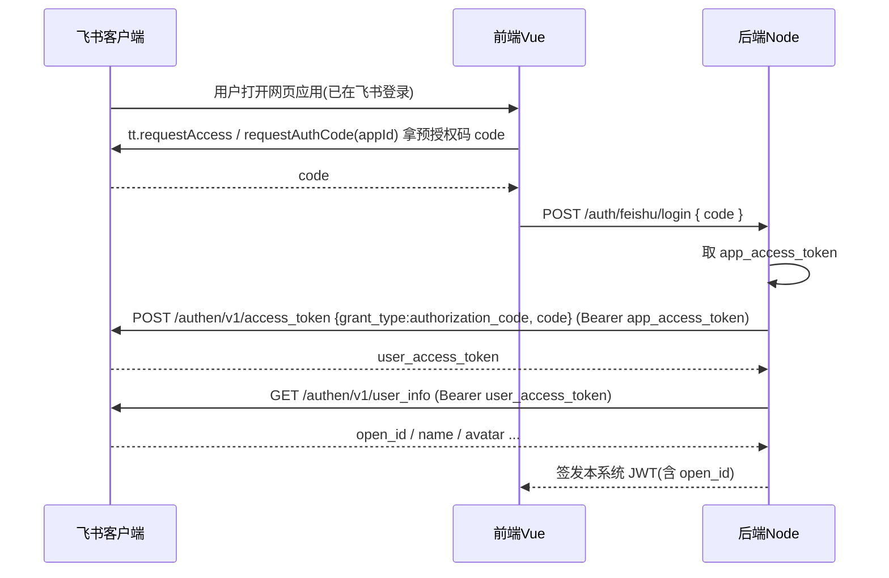

<!--
 * @Author: lzx 1245634367@qq.com
 * @Date: 2026-08-03 22:21:58
 * @LastEditors: lzx 1245634367@qq.com
 * @LastEditTime: 2026-08-03 22:21:59
 * @FilePath: \feishu-work\docs\04-飞书对接方案.md
 * @Description: Fuck Bug
 * 微信：lizx2066
-->
# 04 · 飞书对接方案

> ⚠️ 飞书开放平台接口会随版本演进，**本文给出主流实现方式，最终以 [飞书开放平台文档](https://open.feishu.cn/document) 最新版为准**。可选用官方 Node SDK：`@larksuiteoapi/node-sdk`，避免手写签名/加密。

## 一、前置准备（飞书开发者后台）

> 本项目形态是**飞书客户端内的网页应用**（H5，用户在飞书工作台打开即用），按官方「[网页应用开发指南](https://open.feishu.cn/document/client-docs/h5/development-guide/basic-concepts)」配置。

1. 登录[飞书开发者后台](https://open.feishu.cn/app)，创建**企业自建应用**
2. 应用详情页 → **应用能力** → 添加**网页应用**能力
3. 配置**网页应用主页地址**（需公网地址；开发调试阶段可先填 `http://127.0.0.1:3000`，或用 ngrok 反代；生产环境填正式域名）
4. 安全设置：
   - **H5 可信域名**：若需调用 JSAPI（`tt.*`），必须在此配置页面所在域名（错误码 333447/333448）
   - 重定向 URL（仅浏览器直接访问时用网页授权，见 3.2）：如 `https://your.domain/auth/feishu/callback`
   - 事件订阅：请求地址 `https://your.domain/internal/feishu/approval-callback`，配置校验 Token 与 Encrypt Key
   - 可选 IP 白名单
5. 获取 `App ID` / `App Secret`（放后端环境变量）
6. 在飞书**审批后台**创建审批定义（如"报工审批"），记录 `approval_code`
7. **发布**：应用发布 → 版本管理与发布 → 创建版本 → **默认能力选「网页应用」**、配置**可用范围**（必须包含使用用户，否则无法登录/收消息）→ 申请线上发布

## 二、Token 获取

| 凭证 | 用途 |
|---|---|
| `tenant_access_token` | 服务端 OpenAPI 主用（通讯录/审批/消息）、JSAPI 鉴权拿 jsapi_ticket |
| `app_access_token` | **免登**流程换 `user_access_token` 用 |
| `user_access_token` | 代表用户身份（本项目仅用于取 `open_id`/姓名，不长期依赖） |

### 2.1 tenant_access_token（服务端主用）

```
POST https://open.feishu.cn/open-apis/auth/v3/tenant_access_token/internal
Content-Type: application/json

{ "app_id": "cli_xxx", "app_secret": "xxx" }
```

返回 `{ "code": 0, "tenant_access_token": "...", "expire": 7200 }`

- 有效期 2 小时，需**缓存并提前刷新**（内存缓存 + 定时刷新，避免每请求刷新）

### 2.2 app_access_token（免登换 user_access_token 用）

```
POST https://open.feishu.cn/open-apis/auth/v3/app_access_token/internal
body 同上
```

## 三、用户登录：端内免登（主）+ 网页授权（备）

> 关键：本项目是**飞书客户端内网页应用**，用户在飞书工作台打开应用时**免登**自动识别身份（无需输入账号、无需跳转授权页）。仅当用户用**浏览器**直接访问时才走网页授权 OAuth。

### 3.1 端内免登（推荐，主流程）



- 前端 JSAPI（`requestAccess` 优先，低版本回退 `requestAuthCode`）：

```js
if (window.tt.requestAccess) {
  window.tt.requestAccess({ appID: APP_ID, scopeList: [],
    success: (res) => login(res.code),
    fail: (err) => { if (err.errno === 103) callRequestAuthCode(); } });
} else callRequestAuthCode();
function callRequestAuthCode() {
  window.tt.requestAuthCode({ appId: APP_ID,
    success: (res) => login(res.code), fail: (e) => console.error(e) });
}
```

- 后端换 token（免登标准接口，注意与端外 OAuth 不同）：

```
POST https://open.feishu.cn/open-apis/authen/v1/access_token
Authorization: Bearer {app_access_token}
{ "grant_type": "authorization_code", "code": "{前端传来的code}" }
```

- 免登的 `requestAccess`/`requestAuthCode` **无需 JSAPI 鉴权**（官方明确：除 requestAccess、requestAuthCode、closeWindow 外，其它 JSAPI 才需鉴权）。

### 3.2 网页授权 OAuth（备选，浏览器直接访问时）

1. 跳转：`https://accounts.feishu.cn/open-apis/authen/v1/authorize?app_id=..&redirect_uri=..&state=..`
2. 回调：`redirect_uri?code=..&state=..`
3. 换 token / 拉用户信息（同 3.1；token 接口以飞书最新文档为准）
4. 签发本系统 JWT

### 3.3 本系统会话建议

- 免登/授权只用于**识别当前用户**（取 `open_id`、姓名、头像），拿到后签发自己的 JWT 即可，**不长期依赖 `user_access_token`**（其有效期约 2 小时，且仅文档类 API 才需要）。
- 前端用 JWT 调本系统业务接口；通讯录、审批、消息等由后端用 `tenant_access_token` 调用。

### 3.4 JSAPI 鉴权（可选，本系统首期不需要）

- 报工系统核心是**服务端 OpenAPI**（通讯录/审批/消息），前端一般不需要调用 `tt.*` JSAPI，因此**首期可不做 JSAPI 鉴权**。
- 若后续要在飞书内调用 JSAPI（如 `tt.showToast`、扫码、`tt.openSchema` 等），才需按官方「步骤二」实现：
  1. 后端 `POST /open-apis/jssdk/ticket/get`（Bearer tenant_access_token）拿 `jsapi_ticket`（有效期 2h，缓存复用）
  2. 后端按 `jsapi_ticket` + `noncestr` + `timestamp` + `url` 拼 `verifyStr`，用 **sha1** 计算 `signature`
  3. 前端 `window.h5sdk.config({appId, timestamp, nonceStr, signature, jsApiList})` 鉴权后调用 JSAPI
  4. 前提：安全设置里配置 **H5 可信域名**；SPA 用 history 路由时 URL 需取 `location.href.split('#')[0]`

## 四、通讯录用户列表（不建用户表）

### 4.1 按部门拉取用户

```
GET https://open.feishu.cn/open-apis/contact/v3/users?department_id={dep_id}&page_size=50&page_token={token}
Authorization: Bearer {tenant_access_token}
```

- 先拉部门树：`GET /open-apis/contact/v3/departments?parent_department_id=0`
- 返回用户含 `open_id, union_id, user_id, name, mobile, email, department_ids`

### 4.2 按手机/邮箱反查 ID（可选）

```
POST https://open.feishu.cn/open-apis/contact/v3/users/batch_get_id
body: { "mobiles": [...] } 或 { "emails": [...] }
```

### 4.3 缓存策略

- 全量同步到 `feishu_user_cache`（定时 + 手动），前端下拉/搜索走本地缓存
- 需要最新数据时再触发增量同步

## 五、审批对接

### 5.1 创建审批实例

```
POST https://open.feishu.cn/open-apis/approval/v4/instances
Authorization: Bearer {tenant_access_token}

{
  "approval_code": "报工审批",                 // 审批后台创建的审批定义编码
  "user_id": "{申请人open_id}",
  "form": [
    { "name": "项目",     "value": "项目A" },
    { "name": "报工日期", "value": "2026-08-03" },
    { "name": "普通时长", "value": "8" },
    { "name": "加班时长", "value": "2" },
    { "name": "备注",     "value": "..." }
  ],
  "node_approver_open_id_list": [ ["{项目负责人open_id}"] ]  // 一级审批人
}
```

返回 `instance_id` / `instance_code`，入库 `work_report.approval_instance_id`。

> 说明：`node_approver_open_id_list` 用于指定审批人；若审批定义已配置审批人规则，可省略。

### 5.2 事件回调（主路径，实时）

- 在应用事件订阅中添加 `approval_instance`（审批实例）事件
- 飞书回调 POST 到 `https://your.domain/internal/feishu/approval-callback`
- 事件 `data` 含 `instance_code`、`status`（`CHANGED` 等）、`instance_id`
- 解析后按 `approval_instance_id` 反查本地报工，更新状态
- 注意：事件回调体**可能加密**，需用 Encrypt Key 解密（官方 SDK 已封装）

### 5.3 主动查询（兜底，防丢事件）

```
GET https://open.feishu.cn/open-apis/approval/v4/instances/{instance_id}
Authorization: Bearer {tenant_access_token}
```

- 返回 `status`：`PENDING / APPROVED / REJECTED / CANCELED` 及 `timeline` 审批记录
- 定时任务扫描本地 `status=审批中` 超过 N 分钟的记录做对账

### 5.4 撤销审批实例（报工撤销时）

```
POST https://open.feishu.cn/open-apis/approval/v4/instances/cancel
body: { "instance_id": "...", "user_id": "{申请人open_id}" }
```

## 六、消息通知（审批提醒走飞书）

### 发送应用消息

```
POST https://open.feishu.cn/open-apis/im/v1/messages?receive_id_type=open_id
Authorization: Bearer {tenant_access_token}

{
  "receive_id": "{接收人open_id}",
  "msg_type": "interactive",            // 或 text
  "content": "{ 卡片JSON字符串 }"
}
```

- 文本示例 `content`: `"{\"text\":\"您有一条报工待审批\"}"`
- 卡片（interactive）可带按钮（跳飞书审批/本系统详情），效果更好，推荐审批通知用卡片

### 通知场景

| 场景 | 接收人 | 消息类型 |
|---|---|---|
| 报工提交需审批 | 审批人（项目负责人） | 卡片：待审批 + 入口 |
| 审批通过/驳回 | 报工人 | 卡片/文本：结果 + 原因 |
| 免审批报工生效 | 报工人（可选） | 文本 |
| 超时未审批提醒 | 审批人 | 卡片（定时任务） |

## 七、权限清单

| 权限 | 用途 |
|---|---|
| `contact:user.base:readonly` | 获取用户基本信息（姓名/open_id 等） |
| `contact:user.employee_id:readonly` | 获取工号（可选，用于 employee_id 映射） |
| `contact:department.base:readonly` | 获取部门信息 |
| `im:message` | 获取与发送单聊/群组消息 |
| `im:message:send_as_bot` | 以机器人身份发送消息（可选） |
| `approval:approval` | 创建/查询/撤销审批实例 |
| 网页应用能力 | 端内免登获取用户统一 ID（open_id）、用户信息 |

## 八、注意事项

1. **应用可用范围**：未加入可用范围的用户无法登录、收不到消息。
2. **事件订阅安全**：启用 Encrypt Key + 校验 Token；回调地址必须 HTTPS。
3. **Token 刷新**：tenant_access_token 2h 过期，需缓存复用，避免并发刷爆。
4. **审批编码**：`approval_code` 来自审批后台，与线上/沙箱环境对应。
5. **沙箱与线上**：调试建议用沙箱环境（`https://open.feishu.cn/open-apis` 为线上，沙箱为 `https://open.feishu.cn/open-apis` 内切换环境）。
6. **消息频率限制**：应用消息有频控，发送失败落 `message_log` 支持重试。
7. **open_id 与应用绑定**：open_id 是应用维度，同一用户在不同应用 open_id 不同；本项目统一用本应用 open_id 即可（union_id 跨应用一致，可作备份字段）。

## 九、应用入口与发布

- 发布后用户可在**飞书工作台**搜索并打开应用（移动端/桌面端）
- 可扩展配置入口：聊天框「+」菜单、搜索结果快捷入口、消息快捷操作
- 桌面端主页打开方式：默认在飞书内打开；如需浏览器打开，可在主页 URL 拼 `lk_jump_to_browser=true`（V7.7+）
- 调试：飞书开发者工具 / 网页应用远程调试工具（Android V5.1+）

## 十、示例代码（demo）参考

仓库内 `docs/feishu/demo/web_app_quick_start` 为飞书官方「快速开发网页应用」示例（React + Koa），可直接参考其**免登 + 鉴权**核心实现：

| 文件 | 内容 | 本项目改造点 |
|---|---|---|
| `src/utils/auth_access_util.js` | 前端免登（requestAuthCode）与 JSAPI 鉴权（h5sdk.config） | 迁移到 Vue，`requestAccess` 优先 |
| `server/server.js` | 后端：app_access_token 换 user_access_token、jsapi_ticket + 签名 | 迁移到 NestJS/Express 的 `auth` 模块 |
| `server/server_util.js` | 响应封装、Cookie 工具 | 改造为 JWT 会话 |

> 免登与鉴权原理详见 `docs/feishu/nodejs/` 下《简介》《示例代码说明》，可作为后端实现蓝本。
